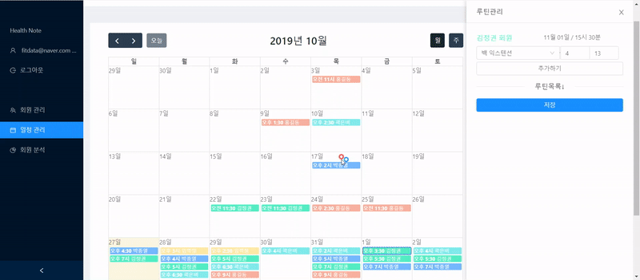
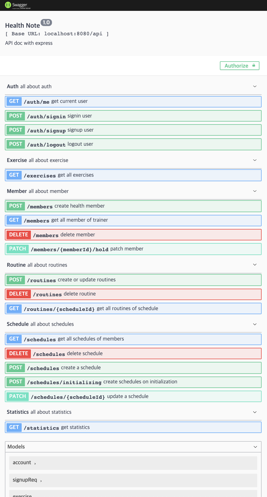

# 동작화면
<br/>
<br/>

> Specification

- node.js express
- sequlize ORM with Mysql
- JSON Token Authorization
- morgan and winston logger
- swagger-ui 

## Gain points
```
1. Authorization support. Json Web Token.
2. Logger support. Morgan and winston.
3. Able to learn how to use sequelize ORM with mysql.
4. Learn how to build a api document and to to do unit test as swagger UI.
```

## INSTALL
```
* Backend
1. cd server 
2. npm install
3. npm run aws or local
```

## Structures
```text
server/
├─ api
│  └─ middlewares 
│  └─ routes      
├─ common/
├─ loaders/         // initailize configuration
├─ models/
├─ services/
├─ utils/
├─ .env             // ignore
├─ app.json
├─ package.json
├─ package-lock.json
```

## .ENV

Run below to make your own `app` variables.

> `cp .env.sample .env`

- `env` variables
  | Name                | default | required | description             |
  | ------------------- | ------- | -------- | ----------------------- |
  | DB_DIALECT          |         | yes      |                         |
  | DB_NAME             |         | yes      |                         |
  | DB_USER             |         | yes      |                         |
  | DB_PASSWORD         |         | yes      |                         |
  | DB_ENDPOINT         |         | yes      |                         |
  | DB_PORT             |         | yes      |                         |
  | PORT             |         | yes      |                         |
  | JWT_SECRET          |         | yes      |                         |

  ```
  # Database AWS
  AWS_DB_DIALECT=
  AWS_DB_NAME=
  AWS_DB_USER=
  AWS_DB_PASSWORD=
  AWS_DB_ENDPOINT=
  AWS_DB_PORT=

  # Database local
  LOCAL_DB_DIALECT=
  LOCAL_DB_NAME=
  LOCAL_DB_USER=
  LOCAL_DB_PASSWORD=
  LOCAL_DB_ENDPOINT=
  LOCAL_DB_PORT=

  # Port
  PORT=

  # Auth
  JWT_SECRET=
  ```

# Running the project
Running the project is as simple as running
```sh
npm run {DBConfiguration}
```

This runs the `{DBConfiguration}` script specified in our `package.json`.

Typically the server runs at `http://localhost:8080`.

# Database design
Database schema is written by AqueryTool

<br/>

# Testing the project
Testing is possible using swagger-ui

<br/>

## Express version
4.17.1